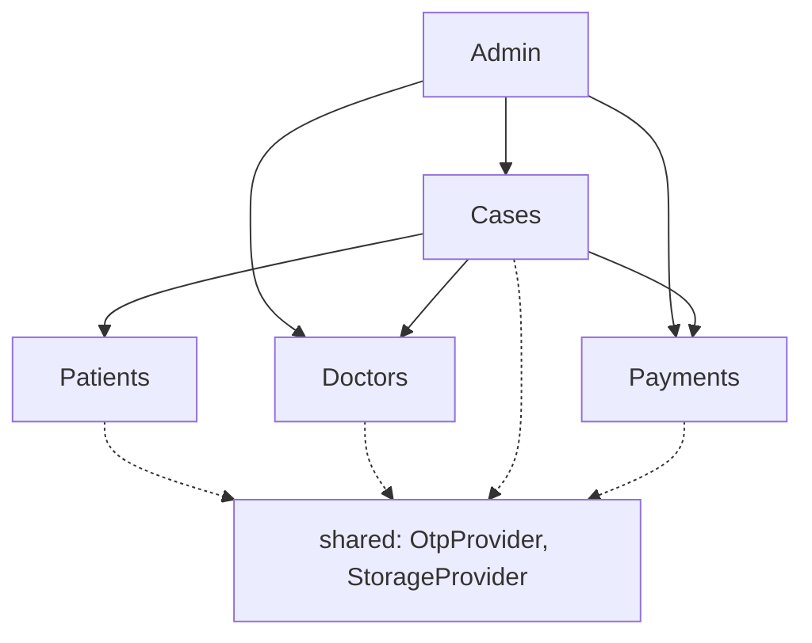
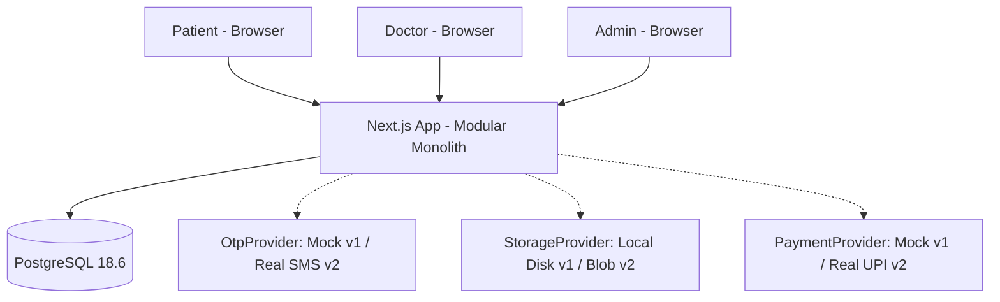
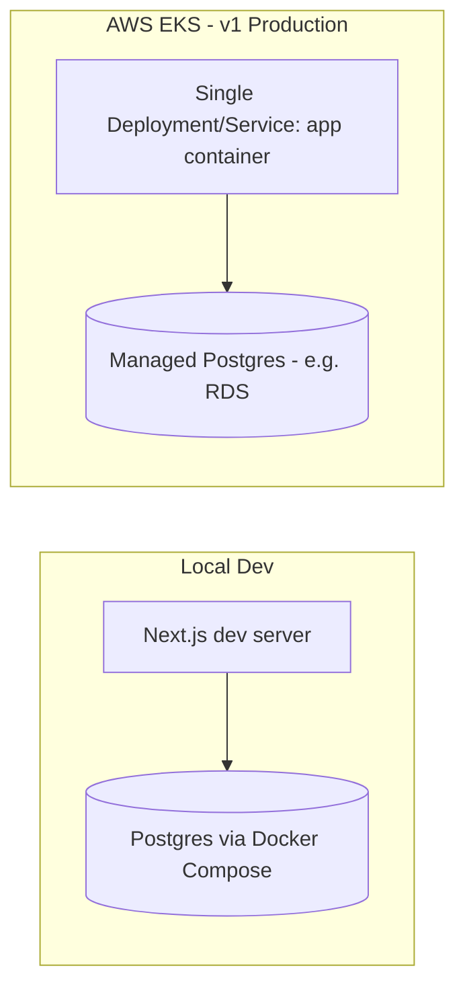

# Architecture Spine — secopinion

## Design Paradigm

**Modular Monolith.** SecOpinion v1 ships as a single deployable Next.js application with hard internal module boundaries drawn by domain: **Patients, Doctors, Cases, Payments, Admin**. Each module is a self-contained vertical slice — its own data, its own service interface, its own routes — living side by side in one process and one deployable artifact. This buys POC-stage simplicity (one thing to run, one thing to deploy) while keeping the seam that lets any single module later become its own service without rewriting the others (see AD-1, AD-2).

Each module maps to `src/modules/<module-name>/`, containing `domain/` (entities, business rules), `service.ts` (the module's only public interface — the seam), `repository.ts` (the module's own DB tables only), and `routes/` (Next.js API route handlers). Cross-cutting concerns that no single module owns (auth session handling, OTP delivery, file storage, payments) are abstracted behind provider interfaces in `src/shared/`.

## Invariants & Rules

### AD-1 — Modular Monolith paradigm [ADOPTED]

- **Binds:** all v1 features
- **Prevents:** microservice-complexity overhead at POC stage while still enabling clean future extraction
- **Rule:** single deployable app; internal module boundaries by domain: Patients, Doctors, Cases, Payments, Admin.

### AD-2 — Module isolation rule [ADOPTED]

- **Binds:** all modules (Patients, Doctors, Cases, Payments, Admin)
- **Prevents:** a distributed-monolith future where extracting a module to its own service requires untangling shared tables or hidden internal references
- **Rule:** (1) each module owns its own DB tables; no module may directly SQL-join or query another module's tables — cross-module reads go through that module's exported service function. (2) modules call each other only via explicit exported interfaces (in-process function calls in v1), never by importing another module's internals — this interface is the seam that gets swapped for HTTP/gRPC if/when a module is extracted into its own service.

**Allowed dependency direction** (who may call whom via `service.ts`):



Patients and Doctors are leaf modules — they never call Cases, Payments, or Admin. Cases orchestrates a case's lifecycle by calling Patients, Doctors, and Payments. Admin sits above all four, invoking their interfaces for verification, reassignment, and refund decisions.

### AD-3 — Payment provider abstraction [ADOPTED]

- **Binds:** Payments module (FR-8, FR-12, FR-13)
- **Prevents:** gateway-specific (mock or real UPI) code leaking into Cases/Payments business logic
- **Rule:** all payment/payout/refund operations go through a `PaymentProvider` interface; v1 ships a `MockPaymentProvider`, v2 swaps in a real UPI gateway adapter behind the same interface without touching calling code.

### AD-4 — Reference-by-ID rule for cross-module references [ADOPTED]

- **Binds:** all modules (Patients, Doctors, Cases, Payments, Admin)
- **Prevents:** hidden coupling via DB-level foreign keys across module boundaries that would block future per-module database/service extraction
- **Rule:** cross-module references are stored as plain ID columns only (e.g. `Case.patientId`, `Case.doctorId`, `Payment.caseId`) — no DB-level foreign-key constraints across module table boundaries, even though v1 uses one shared Postgres instance. Referential validity is enforced at the application layer via the owning module's exported interface (e.g. `DoctorsModule.getVerifiedDoctor(id)`), never by a DB constraint. Modules may still use normal FKs within their own owned tables. Tradeoff accepted explicitly: v1 loses DB-enforced integrity for cross-module refs in exchange for keeping the door open to real microservice extraction on EKS without a rewrite.

### AD-5 — Optional doctor selection at Case submission [ADOPTED]

- **Binds:** Cases module data model (FR-3 registration is separate; this binds Case Submission and FR-9 queue)
- **Prevents:** forcing a doctor pick at submission time when the product flow allows deferred/unassigned cases
- **Rule:** `Case.doctorId` is nullable. At submission, a patient may optionally browse/search verified doctors (Doctors module, verification-status filtered) and pick one; picking a doctor is not mandatory. An unassigned Case enters the open queue (see AD-6). Doctor offboarding: a doctor who wants to leave notifies Admin out-of-band; Admin manually reassigns that doctor's open/in-progress cases to another doctor — `Case.doctorId` must remain admin-mutable after initial assignment, not settable only once.

### AD-6 — Case-to-doctor assignment mechanics [ADOPTED]

- **Binds:** Cases module (FR-9)
- **Prevents:** unbounded assignment race conditions and undefined SLA behavior on reassignment
- **Rule:** (1) Assignment is hybrid pull-or-push, no auto-assignment/specialty-routing in v1 — any verified doctor may browse the open/unassigned-case queue and self-claim a case; independently, Admin may manually assign or reassign any case to any verified doctor at any time (covers both resolving unassigned cases and offboarding reassignment). The atomic claim is mechanized via optimistic locking: `Case.assignmentLockVersion` increments on every assignment change; both the doctor self-claim path and the admin-reassign path go through one exported Cases-service function (e.g. `assignCaseToDoctor(caseId, doctorId, expectedVersion)`) that updates `doctorId` and increments `assignmentLockVersion` only if the passed version still matches — a version mismatch or already-assigned case returns a typed failure the caller must handle (retry on version mismatch, no retry on already-assigned). No separate ad hoc check-then-set implementation is permitted. (2) Reassignment does **not** reset the Response SLA clock — the clock stays anchored to the Case's original submission timestamp regardless of how many times `doctorId` changes, since the incoming doctor inherits the case's existing documents/notes/history from where the prior doctor left off.

### AD-7 — Auth and file storage provider abstractions [ADOPTED]

- **Binds:** Patients/Doctors/Admin auth, Cases module document uploads
- **Prevents:** OTP-gateway or storage-backend specifics leaking into business logic; keeps the v1-to-v2 swap cheap
- **Rule:** (1) OTP delivery goes through an `OtpProvider` interface — v1 ships a `MockOtpProvider` (fixed/logged OTP, no real SMS send), v2 swaps in a real SMS/OTP gateway behind the same interface. The session/auth mechanism itself (JWT-based sessions for Patient/Doctor/Admin roles) is implemented for real in v1 — only the OTP delivery channel is mocked. (2) File/document storage goes through a `StorageProvider` interface — v1 ships a `LocalDiskStorageProvider`, v2 swaps in a cloud blob storage adapter (e.g. S3-compatible, given the AWS EKS deployment target) behind the same interface without touching Cases module business logic.

### AD-8 — SLA breach detection via daily batch job [ADOPTED]

- **Binds:** Cases module Response SLA enforcement (FR-13, Refund Pending transition)
- **Prevents:** over-engineering a real-time/precise timer system the product does not require
- **Rule:** a scheduled job runs once per day (not sub-hour precision) and scans for Cases past the 5-day/120h Response SLA window that are still awaiting an Opinion; matching cases transition to `Refund Pending`. Daily granularity is explicitly acceptable — exact hour/minute precision is not required. v1 implementation is a simple in-process scheduled task; no separate queue/worker infrastructure needed at this scale.

### AD-9 — Consistency conventions [ADOPTED]

- **Binds:** all modules and code
- **Prevents:** divergent naming/response/error styles across independently-built modules
- **Rule:** see Consistency Conventions table below.

### AD-10 — Batched Doctor Payout via daily job [ADOPTED]

- **Binds:** Payments module (FR-12)
- **Prevents:** synchronous payment-gateway calls on the Case-closure request path and the complexity of real-time disbursal at POC stage
- **Rule:** payout is not triggered synchronously when a Doctor submits an Opinion. A daily scheduled job (same batch pattern as AD-8) scans Cases closed with an Opinion since the last run, calculates each Doctor's Payout share, and disburses via `PaymentProvider.payout()` in that batch. Doctors see payout as pending until the next daily batch run.

### AD-11 — Response SLA clock pause/resume precision [ADOPTED]

- **Binds:** Cases module (FR-10, FR-13; refines AD-8's daily breach job)
- **Prevents:** incorrect SLA-breach detection when a Case has spent time in `More Info Requested` (the clock must pause there, not keep running); also prevents two callers reimplementing the elapsed-time calculation differently
- **Rule:** `Case` tracks an array of explicit pause/resume timestamp pairs (`{ pausedAt, resumedAt: DateTime | null }`) — this is the one mandatory shape (not a cumulative counter, and not left as an either/or choice). Entering `More Info Requested` appends a new pair with `resumedAt: null`; the Patient's next Document upload sets that pair's `resumedAt`. Elapsed-time-for-SLA-purposes is computed by exactly one exported function in the Cases module (`computeElapsedSlaTime(case)`) — never reimplemented per caller. Any other module needing elapsed time (e.g. Payments for payout timing) calls that function rather than recomputing from raw pause data. AD-8's daily breach job calls the same function and compares the result against the 5-day/120h threshold.

### AD-12 — Doctor specialty cardinality: multiple specialties per doctor [ADOPTED]

- **Binds:** Doctors module data model, Cases module FR-9 queue filtering
- **Prevents:** a single-specialty schema that would block a Doctor from registering multiple specialties, and ambiguity in how the Case queue matches a Case's condition to a Doctor
- **Rule:** `Doctor.specialties` is a collection (many-to-many or array), not a single scalar field. FR-9's specialty-filtered queue shows a Case to a Doctor if the Case's mapped specialty is included in *any* of that Doctor's registered specialties. This resolves the PRD's open question on this point (§8) — the PRD should be updated to reflect this resolution.

### AD-13 — Formal Case status state machine [ADOPTED]

- **Binds:** Cases module (FR-7 through FR-13, all case lifecycle features), and any module reading/writing Case status (Admin, Payments, Doctors queue)
- **Prevents:** two independently-built modules inventing different state names/transitions, since the Glossary and other ADs only reference state names in prose
- **Rule:** Cases module defines a single closed `CaseStatus` enum and its legal transition graph in one place (e.g. `domain/case-state-machine.ts`); every other module imports this enum rather than redefining it.

  ```mermaid
  stateDiagram-v2
      [*] --> Submitted
      Submitted --> UnderReview: doctor claims or admin assigns
      UnderReview --> MoreInfoRequested: doctor requests documents
      MoreInfoRequested --> UnderReview: patient uploads documents
      UnderReview --> OpinionGiven: doctor submits opinion
      OpinionGiven --> Closed: normal closure
      UnderReview --> RefundPending: daily SLA job detects breach
      MoreInfoRequested --> RefundPending: daily SLA job detects breach while paused
      RefundPending --> Refunded: admin approves refund
      RefundPending --> UnderReview: admin rejects, patient chooses to continue (fresh SLA window)
      Refunded --> Closed
  ```

  Admin reassignment (AD-5/AD-6) mutates `doctorId` without changing status. This enum is the single source of truth referenced by the Capability → Architecture Map for FR-7 through FR-13.

### AD-14 — Document access control ownership [ADOPTED]

- **Binds:** FR-14, `StorageProvider` usage across Cases/Payments/Admin
- **Prevents:** access-control logic splitting across `StorageProvider`, `service.ts`, and route handlers with divergent rules for who can read a Document
- **Rule:** access control for medical Documents is enforced at the owning module's service boundary (Cases module's `service.ts` — Documents are semantically owned by Cases), never inside `StorageProvider` and never re-implemented in a route handler. `StorageProvider`'s interface takes no user/role context and is not responsible for authorization; it only stores/retrieves bytes for an already-authorized caller. Any other module needing a Document (e.g. Payments for audit) must call the Cases module's service function, which performs the patient-owns-case / doctor-assigned-to-case / admin-sees-all check before delegating to `StorageProvider`.

## Consistency Conventions

| Concern | Convention |
| --- | --- |
| Source layout | `src/modules/<module-name>/` per module (patients, doctors, cases, payments, admin), each owning `domain/`, `service.ts` (the AD-2 exported seam), `repository.ts` (module-owned tables only), `routes/`; `src/shared/` holds `OtpProvider`, `StorageProvider` interfaces + mock implementations |
| Naming (code) | TypeScript: `camelCase` vars/functions, `PascalCase` types/classes/components, `kebab-case` files/folders |
| Naming (DB) | Postgres: `snake_case` tables/columns (Prisma maps to `camelCase` models automatically) |
| Cross-module calls | Only via a module's `service.ts` — never import another module's `repository.ts` or internal types directly |
| IDs | UUIDs for all primary keys (not auto-increment ints) — consistent with AD-4 and future service extraction |
| API response envelope | `{ data, error }` — `error` is `null` on success, `{ code, message }` on failure |
| Error handling | Domain errors are typed per module; mapped to HTTP status only at the route-handler boundary — business logic never throws raw HTTP errors |
| Auth context | JWT carries `userId` + `role` (`patient` / `doctor` / `admin`); role-based access is resolved at the route-handler boundary |

## Stack

| Name | Version |
| --- | --- |
| Next.js | 16.3.6 |
| Node.js | 26 LTS (current LTS line as of 2026-09-23; supersedes the 24 LTS line, which entered Maintenance) |
| PostgreSQL | 18.6 |
| Prisma ORM | v7 |

## Structural Seed

**Container/context diagram:**



**Deployment & environments:**



Local laptop development (Docker Compose: app + Postgres) is the v1 dev/POC environment; AWS EKS is the confirmed production target, running the modular monolith as a single Deployment/Service — no per-module services in v1 (module extraction is a v2+ option per AD-1/AD-2).

**Source tree:**

```text
secopinion/
  src/
    modules/
      patients/    # domain/, service.ts, repository.ts, routes/
      doctors/     # domain/, service.ts, repository.ts, routes/
      cases/       # domain/, service.ts, repository.ts, routes/ + daily SLA batch job (AD-8)
      payments/    # domain/, service.ts, repository.ts, routes/ + providers/mock-payment-provider.ts
      admin/       # domain/, service.ts, repository.ts, routes/
    shared/        # OtpProvider, StorageProvider interfaces + mock implementations
    app/           # Next.js App Router pages/API routes
  prisma/
    schema.prisma  # one schema, module-owned table groups (no cross-module FKs — AD-4)
  docker-compose.yml   # local Postgres + app
```

## Capability → Architecture Map

| Capability / Area | Lives in | Governed by |
| --- | --- | --- |
| FR-1 Mobile + OTP Registration | Patients module | AD-7 (OtpProvider), AD-9 |
| FR-2 Post-OTP Credential Setup | Patients module | AD-7, AD-9 |
| FR-3 Guardian Registration for Minors | Patients module | AD-9 |
| FR-4 Doctor Registration with Credential Submission | Doctors module | AD-7 (StorageProvider for credential docs), AD-9 |
| FR-5 Manual Verification Review | Doctors + Admin modules | AD-2 (Admin calls Doctors.service), AD-9 |
| FR-6 Doctor UPI Payment Details | Doctors module | AD-9 |
| FR-7 Problem Description and Document Upload | Cases module | AD-7 (StorageProvider), AD-9, AD-14 (access control) |
| FR-8 Urgency Selection and Payment | Cases + Payments modules | AD-3 (PaymentProvider), AD-2 |
| FR-9 Specialty-Filtered Case Queue | Cases module | AD-5, AD-6, AD-12 (multi-specialty match), AD-13 (state machine) |
| FR-10 Request Additional Documents | Cases module | AD-7 (StorageProvider), AD-9, AD-11 (SLA pause), AD-13 |
| FR-11 Submit Opinion and Close Case | Cases module | AD-2, AD-9, AD-13 |
| FR-12 Doctor Payout on Case Closure | Payments module | AD-3 (PaymentProvider), AD-10 (batched payout) |
| FR-13 Admin-Approved Refund on Response SLA Breach | Cases + Payments + Admin modules | AD-6 (SLA clock), AD-8 (daily job), AD-11 (pause/resume), AD-13 (state machine), AD-3 (PaymentProvider) |
| FR-14 Baseline Access Control for Medical Documents | Cross-cutting | AD-14 (access control ownership), AD-7 (StorageProvider), AD-9 (JWT role at route boundary) |

## Deferred

- **Real payment gateway integration** (v2) — v1 uses `MockPaymentProvider` (AD-3); real UPI gateway adapter (e.g. Razorpay, Cashfree) is a v2 build item, swappable behind the same interface.
- **Real OTP/SMS gateway integration** (v2) — v1 uses `MockOtpProvider` (AD-7).
- **Real cloud blob storage adapter** (v2) — v1 uses `LocalDiskStorageProvider` (AD-7), which uses ephemeral Kubernetes pod storage — acceptable only under the single-replica assumption during the POC phase; a PersistentVolume or the v2 cloud blob adapter is required before scaling to multiple replicas or before production cutover.
- **Formal security/compliance program** (encryption at rest, DPDP/HIPAA-equivalent controls) — explicitly out of scope for v1 POC per PRD §4.6; carries a PM-flagged risk, revisit before any real-patient-data production launch.
- **Specialty-based auto-assignment / routing** — ruled out for v1 by AD-6; only pull-claim and admin-assign exist. Revisit if unassigned-case queue depth becomes an operational problem.
- **Microservice extraction of any module** — AD-1/AD-2/AD-4 keep the door open, but no module is extracted in v1; revisit per-module if a specific module's load/team ownership justifies it post-launch.
- **Multi-region / high-availability topology** — single-region, single-Deployment EKS setup for v1; revisit at scale.
- **Full observability/monitoring stack** (metrics, tracing, alerting, dashboards) — not yet decided; revisit before production cutover. Minimum v1 floor is NOT deferred — see note below.
- **CI/CD pipeline specifics** — not yet decided; revisit as part of AWS EKS deployment setup.
- **Backup/DR strategy for Postgres** (Multi-AZ, RPO/RTO targets, snapshot retention) — not yet decided; revisit before production cutover.
- **Deployment scaling specifics** (pod replica count, CPU/memory requests/limits, DB connection pooling strategy, whether daily batch jobs run on every replica or a single designated one) — not yet decided; revisit before production cutover, and before running more than 1 replica in any environment.
- **Platform uptime SLA target** (e.g. 99% vs 99.5%) — not yet decided; revisit at pre-production readiness review. Distinct from the product-facing 5-day/120h Case Response SLA, which is decided (AD-8, AD-11, AD-13).
- **Mid-case urgency escalation** — deferred to v2 per PRD §2.3.
- **Single Admin role scaling** (multiple admins, admin permissions tiers) — v1 keeps a single Platform Admin Account per PRD; revisit if admin workload grows.
- **Exact Doctor Payout percentage split** — a founder-chosen value in the 20-30% platform / 70-80% doctor range, not yet finalized; PRD FR-12 open question, not architecture's to invent.
- **Post-closure clarification channel** (PRD Open Question 7) — whether a Patient can seek any clarification after a Case closes with an Opinion is unresolved at the PRD level; no mechanism exists in v1 either way; not architecture's to invent.
- **Zero-document Case submission and supported Document formats** (PRD Open Questions 3 and 4) — PRD FR-7 `[ASSUMPTION]` tags not yet confirmed; `StorageProvider` validation rules will follow whatever the PRD settles; not architecture's to invent.
- **OTP-fallback login vs. password-only** (PRD Open Question 2) — unresolved at the PRD level; affects the `OtpProvider`/session interaction but the choice itself belongs to product, not architecture.
- **Minimum v1 operational floor (NOT deferred, in scope now):** structured logging to stdout (picked up by EKS's logging path) and failure alerting for the two daily batch jobs (AD-8 SLA-breach scan, AD-10 payout run) are required in v1, given real money and real medical documents are at stake even at POC scale — a silently-failed batch job would mean a missed refund or an unpaid doctor. This is a floor, not the full observability stack deferred above.
